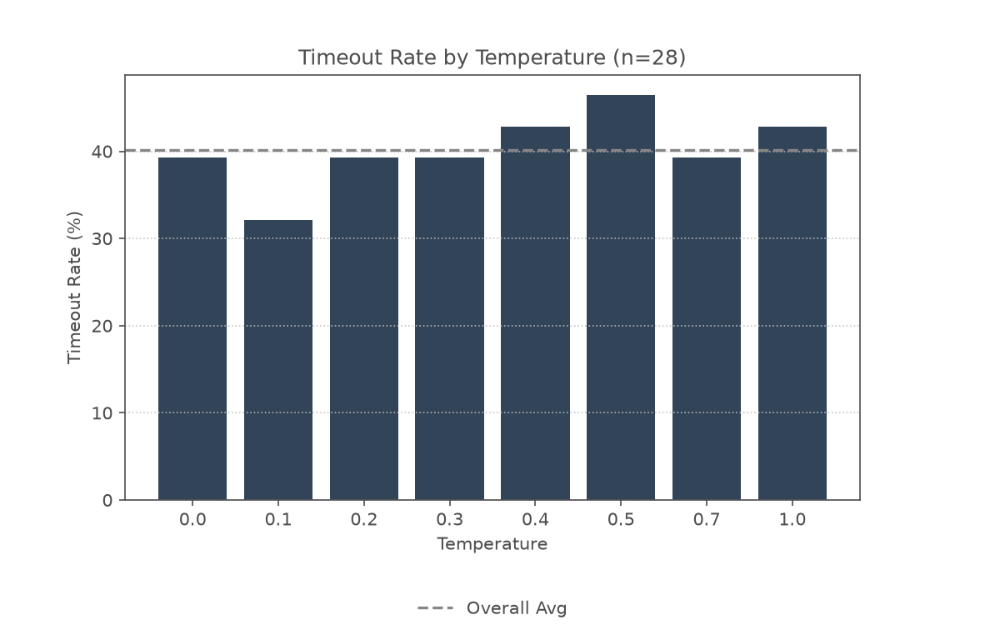

# Agent Comparisons

## Overview of OpenCode Temperature Testing

Through June 18-19, 2026, I tested the impact of temperature settings on agentic performance in OpenCode with the Gemma-4 26B LLM model. OpenCode was provided with a prompt inside of an isolated folder which included a YAML instructions file, providing directions to create a pendulum model file in MuJoCo. Eight temperature values were evaluated, with each being tested 30 times, for a total of 240 test runs. Indicators such as token usage, computational time, and agent looping rate were tracked.

LLM temperature is a tunable parameter that changes output randomness, and is on a scale of 0 to 1. A temperature value of 0 is most likely to repeat output, whereas the LLM is the most randomized at a temperature of 1.

During the course of testing, we observed an average overall failure rate of 40.1% for all temperatures. A failure is indicated when the agent exceeds the threshold time of 150 seconds to complete the task. Often, this is due to looping. Testing showed that the OpenCode/Gemma-4 failure rate was independent of temperature, as all temperatures were within 5% of the average, except for `T = 0.1`, with an average failure rate of 32.1%.

<figure align="center">
    
    <figcaption>Figure 1: Timeout rate vs. temperature bar plot results for the OpenCode agent with Gemma-4 26B Fast LLM creating a simple pendulum MuJoCo model file.
</figure>

As the failure rate is independent of temperature, we probably have an issue with the agent/LLM model selection, directions provided to the model, or the tasking method applied to the model. 

## Next Step: Agent Model Testing

To understand if this is an issue with the model, we will experiment with the various models provided by the Copilot CLI in VSCode. 

## Copilot CLI Agent Testing

Testing of Copilot agents will be identical to the temperature testing executed for OpenCode. Prompt, YAML instructions, and data logging will be carried over from the temperature testing. Necessary modifications to the shell script are made to ensure Copilot only acts within the directory, and cannot reference external files. The test procedure is as follows:

1. `run_copilot_tests.sh` is executed via the command line
2. The shell script finds the first model file, and creates the necessary test folders, copies YAML instructions, and pulls in the correct LLM.
3. The standardized prompt is provided to the Copilot CLI agent.
4. Copilot uses the LLM to understand and execute the task.
5. After completion, token usage, computational time, and other statistics are collected and saved to the workspace data CSV, `model_testing.csv`.

This process is then repeated until all models and the required number of tests for those models are completed. Similar to the temperature testing, limits of 10 steps and 150 seconds are placed to prevent perpetual agent looping. If the model exceeds the step count or time limit, it is recorded as a looping failure.